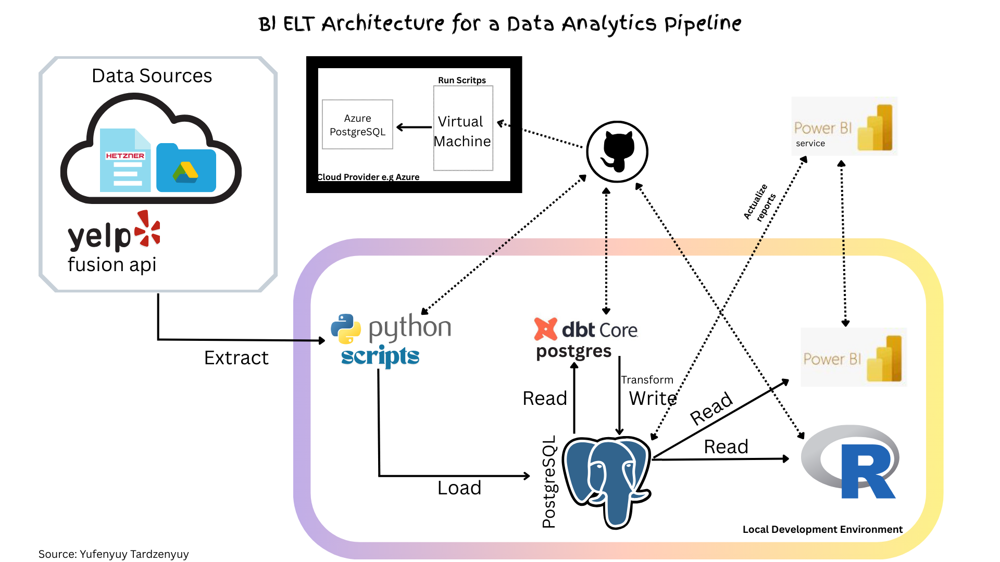

# Business Intelligence Portfolio – Emmanuel Yufenyuy

Master's Student | Business Intelligence – IU International University  
tar.yufenyuy@gmail.com | [LinkedIn](https://www.linkedin.com/in/yufenyuy-tardzenyuy-1039b8183/ "LinkedIn Profile")

---

This repository consolidates all the components of my end-to-end Business Intelligence portfolio, built to demonstrate the implementation of a possible **Extract-Load-Transform and Analyse** Architecture in an organizational context. The key components of this architecture are: data integration, transformation & modeling, and storytelling. It also highlights the possibility of automating the entire process.

The BI ELT Architecture to be implemented is shown on the following image!.

---

## Projects Overview

|Phase| Phase | Title                        | Description                                                                 |
|-----|-------|------------------------------|-----------------------------------------------------------------------------|
|A| 1     | [Data Integration](https://github.com/yufeenyuy/extract_load) | Data integration from Yelp API, Google Drive, and Hetzner stoarge-box |into PostgreSQL with Python. |
|A| 2     | [Data Transformation & Modeling](https://github.com/yufeenyuy/modular_transform)         | Raw data transforming and modeling with SQL (flavour PostgreSQL) and dbt-postgresql adapter.
|A| 3     | [Data Analysis in Power BI](https://github.com/yufeenyuy/data_analysis)         | Data Analysis of Yelp Business reviews with Power BI.|
|A| 4     | [Data Analysis in R](https://github.com/yufeenyuy/r_data_analysis)         | Data Analysis of a fictive *Local Bakery in Paderborn* production data in R. Example univariate time series forcasting of most produced product. The most produced product should also be understood as the most sold product.|
|B| Alle| HaloGreen DWH & ETL-Process & Data Analysis(https://github.com/yufeenyuy/etl_technologies)| Designing and implementing a small DWH and its ETL-Process alongside analysing data based on possible KPIs|
|| 4    | [Project Reports and Course Summaries](https://github.com/yufeenyuy/research-and-course_summaries)      | Summaries & reports from BI-related master's courses.                      |

---

